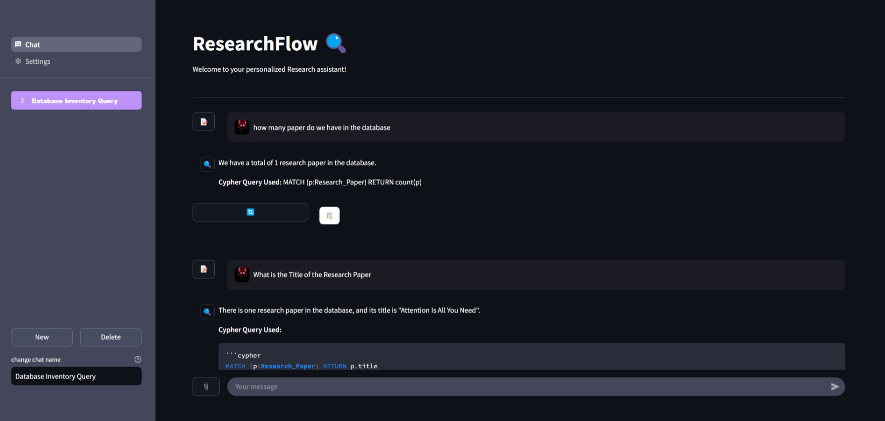
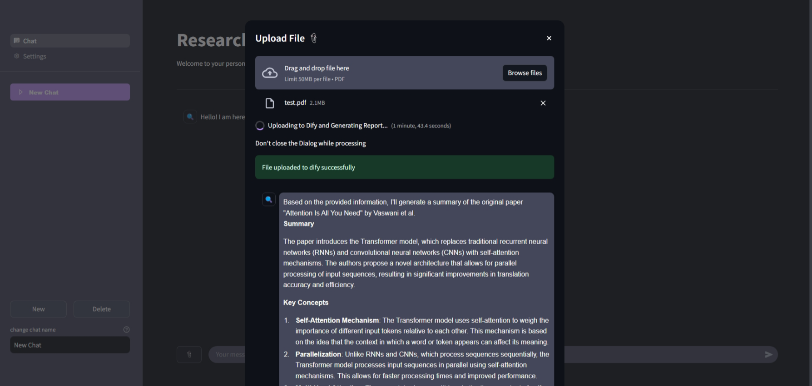
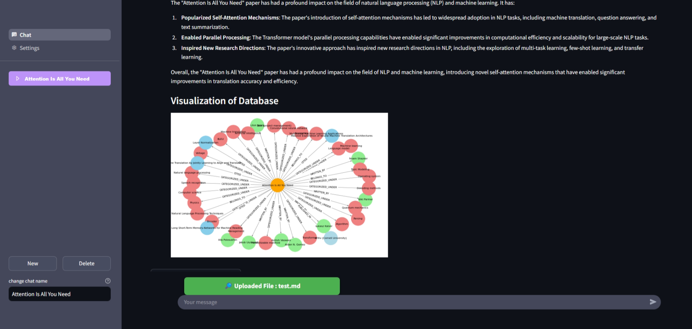
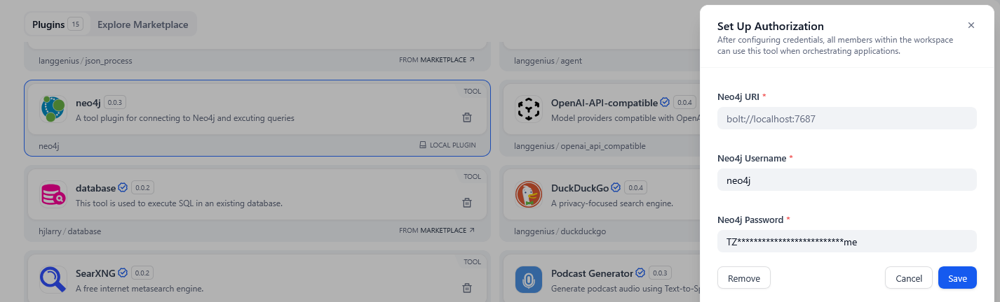
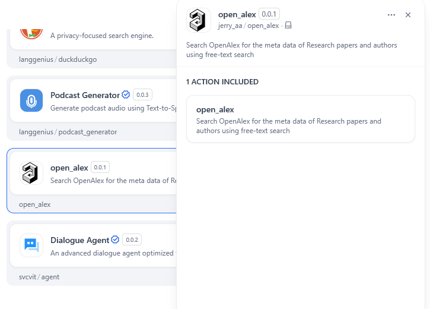
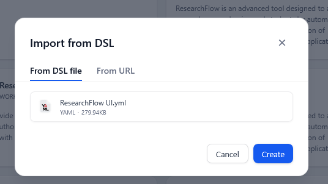
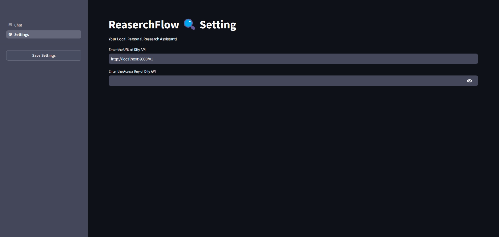
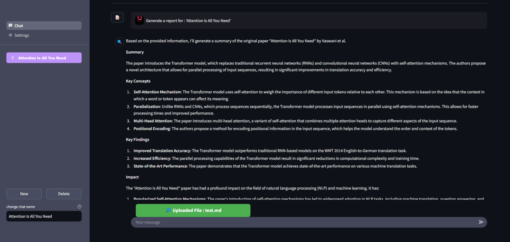
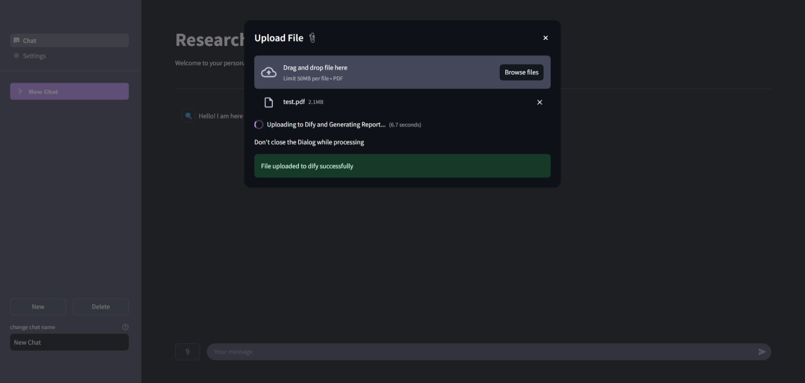

# ResearchFlow

## Overview

ResearchFlow is a personalized research assistant designed to facilitate the extraction of structured knowledge from research papers. It leverages **DIFY**, **LLMs**, and **API tools** to process research PDFs, extract metadata, and build a knowledge graph for better research organization.

## Features







- Extracts and summarizes research papers using **LLMs**.
- Uses **OpenAlex** for metadata retrieval.
- Builds **Neo4j-powered** knowledge graphs.
- Provides an intuitive interface for users via a **Streamlit** app.
- Enables users to input research PDFs and visualize relationships between key research components.

## Prerequisites

Before running ResearchFlow, ensure you have:

- **Neo4j Account** with access to api configurations.
- **Dify Account** with LLMs already configured (Recommended LLM : Llama3.2:latest ).


## Installation & Setup

### 1. Install Required Dependencies

Ensure that you have Python installed and set up a virtual environment:

```sh
python -m venv researchflow_env
source researchflow_env/bin/activate  # On Windows use: researchflow_env\Scripts\activate
pip install -r requirements.txt
```

### 2. Start DIFY and Install Plugins

- Start DIFY and navigate to the `dify_files` folder.
- Install the **Neo4j** and **OpenAlex** plugins.
- Import the `ResearchFlow.dsl` file into DIFY and publish it.
- Get the Dify API URL and API Key for the ResearchFlow Dify App





### 3. Run the Streamlit App

To launch the ResearchFlow assistant, run:

```sh
streamlit run main.py
```

### 4. Configure ResearchFlow

- Navigate to **Settings** in ResearchFlow.
- Enter the **DIFY API URL** and **API Key**.
- Click **Save Settings**.





## Usage

1. Upload a **PDF research paper**.
2. The app extracts text and processes key metadata.
3. The **LLM** generates a structured summary.
4. The **Graph Builder** organizes the data into a **Neo4j knowledge graph**.
5. Users can **query** and **visualize** relationships between research components.



## Troubleshooting

- If the API is not responding, check the **DIFY API Key** and ensure the server is running.
- If the knowledge graph is not building, verify that **Neo4j** is correctly integrated in **DIFY**.
- Ensure all dependencies are installed with `pip install -r requirements.txt`.

## Contributors

Developed as part of the **GenAI Portfolio Exam 2024/25** under the **DFKI, RPTU Kaiserslautern**.

## License

MIT License

